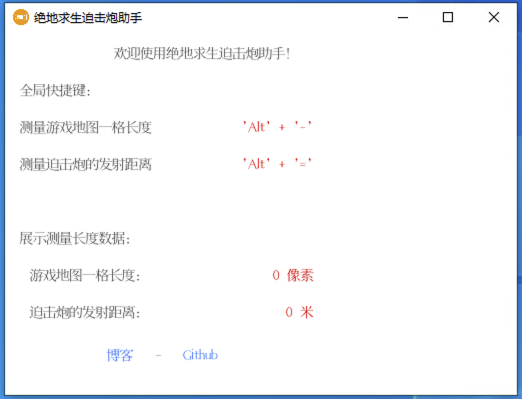

# pubg-mortar-assistant
## 前言

在玩绝地求生游戏时，使用迫击炮攻击，一次人也没打到，一气之下写了这个程序，希望大家天天吃鸡！

## 操作说明

1. `Alt` + `-` 测量**<font style="color:red;">游戏地图中一个格子</font>**在当前显示器屏幕长度
2. `Alt` + `=` 测量迫击炮发射距离

**<font style="color:red;">注意：</font>**

- 在使用操作2之前，需要先执行操作1
- 在缩放改变地图大小后，需要重新执行操作1，因为pubg里面一个格子代表1km，缩放之后地图就变化了

## 截图




## 运行

只需使用go工具在您的系统上安装并运行即可。

    $ go mod tidy
    $ go run main.go

## 打包

打包应用，请使用`fyne`工具。

```shell
$ go get fyne.io/fyne/v2/cmd/fyne
$ fyne install

# macos打包
$ fyne package -os darwin -icon resource/desktop_icon.png
# windows打包
$ fyne package -os windows -icon resource/desktop_icon.png
```
